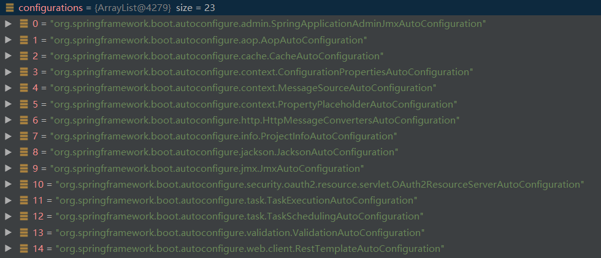
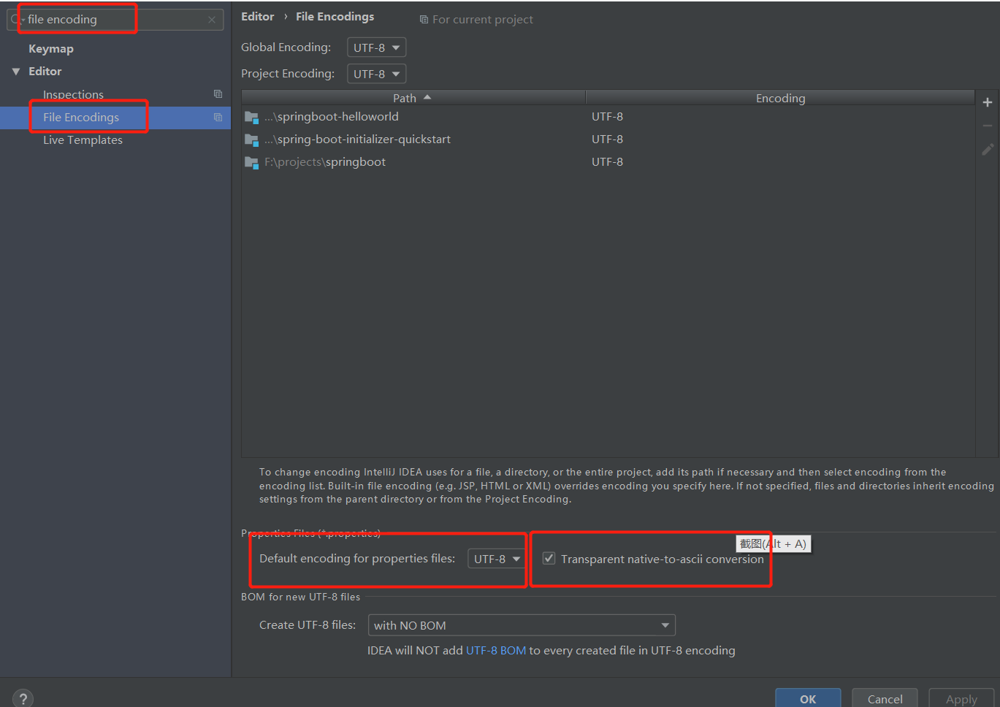

# Spring Boot
## 1 Spring Boot入门

### 1.1 Spring Boot简介

> 简化Spring应用开发的一个框架
>
> 整个Spring技术栈的一个大整合
>
> J2EE的一站式解决方案

* Spring boot基于Spring4.0设计，不仅继承了Spring框架原有的优秀特性，而且还通过简化配置（约定大于配置）来进一步简化了Spring应用的整个搭建和开发过程。
* 优点
  1. 快速创建独立运行的Spring项目以及主流框架集成
  2. 使用嵌入式的Servlet容器，应用无需打成war包
  3. starters自动依赖与版本控制
  4. 大量的自动配置，简化开发，也可以修改默认值
  5. 无需配置xml，无代码生成，开箱即用
  6. 准生产环境的运行时应用监控
  7. 与云计算的天然集成

[Springboot官方学习文档](https://docs.spring.io/spring-boot/docs/2.3.0.RELEASE/reference/html/howto.html#howto)

### 1.2 微服务 Microservices

* 单体应用All In One（traditional web application architecture）: 将应用的所有服务放入一个项目中
  * 优点
    1. Simple to develop, test, deploy, scale(扩展，很方便进行水平扩展通过负载均衡提高并发能力)
  * 缺点
    1. 修改困难
    2. 不适合大型分布式应用
* 2014 Martin Fowler详细阐述了[微服务](https://martinfowler.com/microservices/)，是一种架构风格，核心是一个应用应该是一组小型服务的组合，通过http协议进行通信。
* 一个微服务架构把每个功能元素放进一个独立的服务器中，通过跨服务器分发这些服务进行扩展，并在需要的时候对其中一些功能单元进行复制（水平扩展到几个服务器中）
* 每一个功能元素都是一个可独立替换和独立升级的软件单元
* 对于大型分布式应用
  * build: spring boot快速构建
  * coordinate: spring cloud进行互联
  * connect: spring clound data flow进行流式计算、批处理
### 1.3 Hello World
`功能：浏览器发送一个hello.do请求，服务器接收请求并响应“Hello World”字符串`

#### 1.3.1 创建maven工程

#### 1.3.2  导入依赖

```xml
<parent>
		<groupId>org.springframework.boot</groupId>
		<artifactId>spring-boot-starter-parent</artifactId>
		<version>2.2.2.RELEASE</version>
</parent>
<dependencies>
		<dependency>
			<groupId>org.springframework.boot</groupId>
			<artifactId>spring-boot-starter-web</artifactId>
		</dependency>

		<dependency>
			<groupId>org.springframework.boot</groupId>
			<artifactId>spring-boot-starter-test</artifactId>
			<scope>test</scope>
			<exclusions>
				<exclusion>
					<groupId>org.junit.vintage</groupId>
					<artifactId>junit-vintage-engine</artifactId>
				</exclusion>
			</exclusions>
		</dependency>
</dependencies>
```

#### 1.3.3 编写主程序类

* 在类上使用注解@SpringBootApplication，用来表示项目是SpringBoot项目，并且当前类是主程序类
* 主程序类中编写main方法，使用SpringApplication.run(Class clazz, String[] args)
  * 第一个参数是主程序类的Class对象，即被@SpringBootApplication注解标注过的类
  * 第二个参数是main函数的args参数

```java
@SpringBootApplication
public class HelloWorldApp
{
    public static void main( String[] args )
    {
        // 启动Spring boot应用
        SpringApplication.run(HelloWorldApp.class, args);
    }
}
```


#### 1.3.4 编写相关的Controller、Service等业务逻辑

```java
@Controller
public class HelloController {

    @RequestMapping("/hello.do")
    @ResponseBody
    public String getHelloWorld() {
        return "这是我的第一个Spring Boot程序";
    }
}
```

注：运行时不需要部署在tomcat服务器上，内嵌了tomcat插件

#### 1.3.5 运行主程序

#### 1.3.6 部署项目

* 不需要将项目打包成war包，spring boot项目可以打包成可执行的jar包
* 需要先导入插件

```xml
<build>
	<plugins>
    	<plugin>
        	<groupId>org.springframework.boot</groupId>
            <artifactId>spring-boot-maven-plugin</artifactId>
        </plugin>
    </plugins>	
</build>
```

* 运行maven的package命令，会将项目打包到target目录下，变成一个可执行的jar包
* 通过`java -jar [jar包的名字]` 运行
* 即使目标服务器没有安装tomcat服务器，也可以运行，内集成了tomcat的jar包

### 1.4 Hello World探究

#### 1.4.1 POM文件

##### 1.4.1.1 父项目

* spring-boot-starter-parent

```xml
<parent>
        <groupId>org.springframework.boot</groupId>
        <artifactId>spring-boot-starter-parent</artifactId>
        <version>2.2.2.RELEASE</version>
</parent>

<!-- spring-boot-starter-parent依赖的父项目
	spring-boot-starter-dependencies进行版本控制，定义了几乎所有要使用的依赖的版本-->
<groupId>org.springframework.boot</groupId>
<artifactId>spring-boot-dependencies</artifactId>
<version>2.2.2.RELEASE</version>
```

* spring-boot-starter-dependencies
  * Springboot的版本仲裁中心（依赖的版本控制）：导入相关依赖不需要申明版本号

##### 1.4.1.2 启动器starters

* spring-boot-starter-web
  * spring-boot场景启动器，导入web模块正常运行所依赖的组件

```xml
<dependency>
           <groupId>org.springframework.boot</groupId>
            <artifactId>spring-boot-starter-web</artifactId>
</dependency>
```

* Springboot将所有的功能场景都抽取出来，形成一个个的启动器starters，只需要在项目中导入这些starter，相关场景的所有依赖（版本在starter-parent的父项目starter-dependencies中已经声明好了）都会导入进来。要用具体的功能就导入对应的启动器

#### 1.4.2 主程序类

```java
@SpringBootApplication
public class HelloWorldApp
{
    public static void main( String[] args )
    {
        SpringApplication.run(HelloWorldApp.class, args);
    }
}
```

@**SpringBootApplication**: Springboot应用，标注的类为主配置类，Springboot应该允许主程序类的main方法来启动应用

```java
@Target(ElementType.TYPE)
@Retention(RetentionPolicy.RUNTIME)
@Documented
@Inherited
@SpringBootConfiguration
@EnableAutoConfiguration
@ComponentScan(excludeFilters = { @Filter(type = FilterType.CUSTOM, classes = TypeExcludeFilter.class),
		@Filter(type = FilterType.CUSTOM, classes = AutoConfigurationExcludeFilter.class) })
public @interface SpringBootApplication {
```

@**SpringBootConfiguration**: Springboot的配置类，标注在某个类上，表示这个类是Springboot的配置类

```java
@Target({ElementType.TYPE})
@Retention(RetentionPolicy.RUNTIME)
@Documented
@Configuration
public @interface SpringBootConfiguration {
```

@**Configuration**: Spring注解，表示此类是一个配置类

```java
Target({ElementType.TYPE})
@Retention(RetentionPolicy.RUNTIME)
@Documented
@Component
public @interface Configuration {
```

@**Component**: 表示该类是Springboot的一个组件

​	所以配置类也是容器的一个组件

@EnableAutoConfiguration： 开启自动配置

​		以前我们需要配置的地方，现在Springboot帮我们自动配置

​		@**EnableAutoConfiguration**告诉Springboot开启自动配置功能，这样才能生效

```java
@Target(ElementType.TYPE)
@Retention(RetentionPolicy.RUNTIME)
@Documented
@Inherited
@AutoConfigurationPackage
@Import(AutoConfigurationImportSelector.class)
public @interface EnableAutoConfiguration {
```

@**AutoConfigurationPackage**: 自动配置包

```java
@Target(ElementType.TYPE)
@Retention(RetentionPolicy.RUNTIME)
@Documented
@Inherited
@Import(AutoConfigurationPackages.Registrar.class)
public @interface AutoConfigurationPackage {
```

@Import(AutoConfigurationPackages.Registrar.class): Spring的注解，给容器中导入一个组件AutoConfigurationPackages.Registrar.class

<u>@**AutoConfigurationPackage**将主程序类的所在包以及所有的子包里面的所有组件扫描到容器中</u>

@Import(AutoConfigurationImportSelector.class)： 给容器导入一个组件AutoConfigurationImportSelector: 自动配置导入选择器	选择导入哪些组件

​		将所有组件以全类名的方式返回，这些组件会添加到容器中

​		会给容器导入非常多的自动配置类（XxxAutoConfiguration），就是给容器导入这个场景需要的所有组件，并配置好这些组件



有了自动配置类，免去了手动编写配置注入功能组件等的工作

​	getAutoConfigurationEntry(AutoConfigurationMetadata, AnnotationMetadata): 得到自动配置元素

​	SpringFactoriesLoader.loadFactoryNames(EnableAutoConfiguration.class, classLoader): Springboot在启动的时候从类路径下的META-INF/spring.factories中获取EnableConfiguration的值，将这些值作为自动配置类导入到容器中，自动配置类生效，并进行自动配置

J2EE的整体整合解决方案和自动配置都在`spring-boot-autoconfigure-2.2.2RELEASE.jar`中

### 1.5 使用Spring Initializer快速创建Springboot项目

IDE支持使用Spring的项目创建向导快速创建一个Springboot项目

idea：Spring Initializer

eclipse： Spring Starter Project

选择需要使用的模块，向导会联网自动创建

默认生成的Springboot项目：

* 主程序生成好了，只需要编写项目逻辑
* resources目录生成，并带有一下结构
  * static文件夹保存所有的静态资源
  * templates文件夹保存所有的模板页面（Springboot默认的jar包使用嵌入式的tomcat，不支持JSP页面，可以使用模板引擎freemarker或者thymeleaf）
  * application.properties: Springboot应用的配置文件，可以修改一些设置（比如设置端口号server.port=8081）


如果Controller类中的所有方法的返回结果不是跳转页面，而是返回数据，可以直接在类上加@**ResponseBody**

如果一个Controller在类上有@ResponseBody，可以将该注解与@Controller一起替换为@**RestController**，表示是RESTFul风格的controller

## 2 Springboot 配置

### 2.1 配置文件

Springboot可以使用两种全局配置文件（文件的名称不能改变）

* application.properties
* application.yml

配置文件放在src/main/resources目录下或者是类路径/config下

配置文件的作用：修改Springboot自动配置的默认值

YAML（YAML Ain't Markup Language）

​	YAML A Markup Language

​	YAML isn't Markup Language

标记语言：

​	以前的配置文件，大多都是xml文件

​	yaml：以数据为中心，比json，xml更适合做配置文件

yml实例

```yaml
server:
  port: 80
```

### 2.2 yml语法

#### 基本语法

k: v  		（冒号和value之间必须有**空格**）

使用缩进表示层级关系，缩进时不允许使用Tab键，只允许使用**空格**

缩进的空格数目不重要，只需要相同层次的元素左侧对齐即可

```yaml
server: 
    port: 8081
    path: /hello
```

yaml对元素的**大小写敏感**


#### 字面量（数字，字符串，日期，布尔）

k: v

字面量直接写，字符串默认不用加上单引号或双引号

双引号：双引号不会影响特殊字符，特殊字符作为字符本身想表示的意思

​	name: "zhangsan \n lisi"            zhangsan 换行 lisi     

单引号：单引号不会影响特殊字符，特殊字符作为普通的字符串

​	name: 'zhangsan \n lisi'            zhangsan \n lisi     

#### 对象，map（键值对）

注意空格的缩进

```yaml
student: 
   name: zhangsan
   age: 20
```

行内写法

```yaml
student: { name: zhangsan, age: 20}
```

#### 数组，list，Set

用-值表示数组中的一个元素

```yaml
pets: 
  - cat
  - dog
  - pig
```

行内写法

```yaml
pets: [cat,dog,pig]
```

### 2.3 配置文件注入（配置文件属性获取）

#### yml方式

javabean

```java
/**
 * 将配置文件中每一个属性映射到这个组件中
 * @ConfigurationProperties：告诉Springboot将本类中的所有属性和配置文件中相关的配置进行绑定
 * prefix = "person"  配置文件中名为person下面的所有的属性进行一一映射
 * 只有这个组件在容器中的时候，才可以使用容器提供的功能，比如上面的配置文件信息动态绑定
 */
@ConfigurationProperties(prefix = "person")
@Component
public class Person {

    private String name;
    private Integer age;
    private Date birth;
    private Address address;
    private Map<String, String> maps;
    private List<String> pets;
    ...
        
public class Address {

    private String country;
    private String city;
    ...
```

yaml

```yaml
person:
  name: zhangsan
  age: 20
  birth: 2020/6/4
  address:
    country: China
    city: Shanghai
  maps:
     k1: v1
     key2: value2
  pets:
    - dog
    - cat
```


springboot配置文件处理器，编写配置文件的属性时进行提示

```xml
<dependency>
	<groupId>org.springframework.boot</groupId>
    <artifactId>spring-boot-configuration-processor</artifactId>
    <optional>true</optional>
</dependency>
```

@SpringBootTest允许进行测试，并提供自动注入等功能

<hr>

#### properties文件方式

如果使用application.properties文件进行注入

```properties
person.name=张三
person.age=20
person.birth=2020/6/4
person.address.country=中国
person.address.city=上海
person.maps.k1=v1
person.maps.key2=value2
#数组形式的值用逗号隔开
person.pets=dog,cat,mouse
```

javabean的编写与之前yaml中的相同

如果遇到的中文乱码问题，因为idea中的properties文件的默认编码格式是utf-8，但是通常的properties文件的编码是ASCII码，所以需要在settings中的file encoding中将运行时转换为ASCII码选中（Transparent native-to-ascii conversion）



#### @ConfigurationProperties与@Value比较

|                      | @ConfigurationProperties                                     | @Value     |
| -------------------- | ------------------------------------------------------------ | ---------- |
| 功能                 | 批量注入配置文件中的属性                                     | 一个个指定 |
| 松散绑定（松散语法） | 支持（lastName和last-name和last_name都可以）                 | 不支持     |
| SpEL                 | 不支持                                                       | 支持       |
| JSR303数据校验       | 支持（在类上使用@Validated进行校验，对于属性可以使用@Email检验是否符合邮箱格式） | 不支持     |
| 复杂类型封装         | 支持，比如map数据类型的封装                                  | 不支持     |

* 如果只是在某个业务逻辑中需要获取一下配置文件中的某项值，使用@Value

```java
@Value("${person.name}")
    private String name;

    @RequestMapping("/sayHello.do")
    public String sayHello() {
        return "你好 " + name;
    }
```

* 如果专门编写一个JavaBean来和配置文件进行映射，就使用@ConfigurationProperties

#### @PropertySource与@ImportResource

@**PropertySource**：加载指定的properties配置文件（如果将所有的配置写在全局配置文件中，显得有些繁杂）

需要和@ConfigurationPropties一起使用

@ImportResource：导入spring的配置文件，让配置文件的内容生效

在启动时读取spring配置文件

```xml
<?xml version="1.0" encoding="UTF-8"?>
<beans xmlns="http://www.springframework.org/schema/beans"
       xmlns:xsi="http://www.w3.org/2001/XMLSchema-instance"
       xsi:schemaLocation="http://www.springframework.org/schema/beans http://www.springframework.org/schema/beans/spring-beans.xsd">

    <bean id="address" class="cn.zhanguozhi.springboot.bean.Address">
        <property name="country" value="中国"/>
        <property name="city" value="九江"/>
    </bean>
</beans>
```


```java
@ImportResource(locations = "classpath:bean.xml")
@SpringBootApplication
public class SpringBootInitializer {

    public static void main(String[] args) {
        SpringApplication.run(SpringBootInitializer.class, args);

    }
}
```


但是这种添加组件方式比较麻烦

Springboot推荐使用纯注解的配置类给容器添加组件

```java
@Configuration
public class MyAppConfig {

    @Bean
    public Address getAddress() {
        Address address = new Address();
        address.setCountry("中国");
        address.setCity("江西");
        return address;
    }
}
```

@Configuration: 指明当前类是一个配置类，用来代替配置文件

@Bean：将方法的返回值添加到容器中，默认的bean的id是方法名


### 2.4 配置文件占位符(properties和yml都支持)

#### 随机数

配置文件中可以使用随机数  ${random.value}, ${random.int}, ${random.long}, ${random.long}, ${random.int(10)}, ${random.int[1024, 65536]}

配置文件可以使用uuid   ${random.uuid}

#### 属性配置占位符

可以在配置文件中引用之前配置过的属性

```properties
app.name=MyApp
app.description=${app.name} is a Springboot application
```

可以对属性设置默认值

```properties
app.description=${app.price:100} is cheap
```

如果app.price在配置文件中没有配置，则使用冒号后面的默认值100

### 2.5  Profile多环境

>Profile是Spring对不同环境（比如开发环境、测试环境、生产环境）提供不同配置功能的支持，可以通过激活、指定参数等方式快速切换环境

#### 1、多profile文件形式

1. 创建多个profile文件形式

   格式：application-{profile}.properties

   比如：application-dev.properties(开发环境),application-prod.properties(生产环境)

全局配置文件

```properties
server.port=8080
spring.profiles.active=dev
```

application-dev.properties

```properties
server.port=8081
```

运行时，application-dev配置文件生效，端口为8081

2. 激活

- 命令行参数：--spring.profiles.active=dev
- 全局配置文件: spring.profiles.active=dev
- jvm参数：-Dspring.profile.active=dev

#### 2、多profile文档块模式

在yml配置文件中，可以将文件分为几个文档（Document），用---进行分隔

```yaml
spring:
  profiles:
    active: dev
#文档块1
---
server:
  port: 8081
spring:
  profiles: dev
#文档块2
---
server:
  port: 8082
spring:
  profiles: prod
#文档块3
```

命令行参数与jvm参数激活方式与前一种相同

### 2.6 配置文件加载位置

springboot启动会扫描以下位置的application.properties或者application.yml文件作为springboot的默认配置文件

-file: ./config/

-file: ./		(项目根目录下)

-classpath: /config/

-classpath:/ 		(resources目录下)

优先级从高到低，高优先级的配置会覆盖低优先级的配置

springboot会从上述四个位置全部加载配置文件，并且这些配置文件会形成**互补配置**，即低优先级的配置如果在高优先级的配置文件中不存在，则仍然生效

***

另外：还可以通过命令行参数spring.config.location来改变默认的配置文件位置（此时，命令行设置的配置文件的优先级最高）

**项目打包好之后，可以重新运行项目并传入新配置文件的位置作为参数，读取指定配置文件，并于原来的配置文件进行互补配置**

```
java -jar [项目打包之后的jar名称].jar --spring.config.location=[新配置文件的绝对路径]
```

### 2.7、外部配置加载顺序

Springboot可以从以下位置加载配置；优先级从高到低；高优先级的配置覆盖低优先级的配置，并形成互补配置

**1.命令行参数**

```java
java -jar springboot.jar --server.port=8081 --server.servlet.context-path=/boot
```

多个配置项用空格隔开，--配置项=值

2.来自java:comp/env的JNDI熟悉

3.Java系统属性（System.getProperties()）

4.操作系统环境变量

5.RandomValuePropertySource配置的random.*属性值


将配置文件与jar包放在同一目录即可

由jar包外向jar包内进行寻找，优先加载带profile

**6.jar包外部的application-{profile}.properties或application.yml（带spring.profile）配置文件**

**7.jar包内部的application-{profile}.properties或application.yml（带spring.profile）配置文件**

**8.jar包外部的application-{profile}.properties或application.yml（不带spring.profile）配置文件**

**9.jar包内部的application-{profile}.properties或application.yml（不带spring.profile）配置文件**

10.@Configuration注解类上的@PropertySource

11.通过SpringApplication.setDefaultProperties指定的默认属性

详细的外部加载位置见官网文档，共有17种

### 2.8 自动配置原理

#### 1、自动配置原理：

1、springboot启动的时候加载主配置类，开启了自动配置功能@**EnableAutoConfiguration**

2、@**EnableAutoConfiguration**的作用：@Import(AutoConfigurationImportSelector.class)，利用selector给容器导入了一些组件，AutoConfigurationSelector通过selectImports()方法，调用getAutoConfigurationEntry来解析注解元数据AnnotationMetaData

```java
// 获取候选配置
List<String> configurations = getCandidateConfigurations(annotationMetadata, attributes);
```

getCandidateConfigurations

```java
protected List<String> getCandidateConfigurations(AnnotationMetadata metadata, AnnotationAttributes attributes) {
    	// 得到配置类的值
		List<String> configurations = SpringFactoriesLoader.loadFactoryNames(getSpringFactoriesLoaderFactoryClass(),
				getBeanClassLoader());
		Assert.notEmpty(configurations, "No auto configuration classes found in META-INF/spring.factories. If you "
				+ "are using a custom packaging, make sure that file is correct.");
		return configurations;
	}
```

loadFactoryNames

```java
public static List<String> loadFactoryNames(Class<?> factoryType, @Nullable ClassLoader classLoader) {
		String factoryTypeName = factoryType.getName();
    	// factoryTypeName（EnableAutoConfiguration.class的类名）对应在map缓存中的值
		return loadSpringFactories(classLoader).getOrDefault(factoryTypeName, Collections.emptyList());
	}
```

loadSpringFactoties（加载类路径下的所有META-INF/spring.factories文件的键值，封装到map缓存中）

```java
private static Map<String, List<String>> loadSpringFactories(@Nullable ClassLoader classLoader) {
		MultiValueMap<String, String> result = cache.get(classLoader);
    	// 只加载一次
		if (result != null) {
			return result;
		}

		try {
			Enumeration<URL> urls = (classLoader != null ?
					classLoader.getResources(FACTORIES_RESOURCE_LOCATION) :
					ClassLoader.getSystemResources(FACTORIES_RESOURCE_LOCATION));
			result = new LinkedMultiValueMap<>();
			while (urls.hasMoreElements()) {
				URL url = urls.nextElement();
				UrlResource resource = new UrlResource(url);
				Properties properties = PropertiesLoaderUtils.loadProperties(resource);
				for (Map.Entry<?, ?> entry : properties.entrySet()) {
					String factoryTypeName = ((String) entry.getKey()).trim();
					for (String factoryImplementationName : StringUtils.commaDelimitedListToStringArray((String) entry.getValue())) {
						result.add(factoryTypeName, factoryImplementationName.trim());
					}
				}
			}
			cache.put(classLoader, result);
			return result;
		}
		catch (IOException ex) {
			throw new IllegalArgumentException("Unable to load factories from location [" +
					FACTORIES_RESOURCE_LOCATION + "]", ex);
		}
	}
```


getCandidateConfigurations方法通过SpringFactoryLoader的loadFactoryNames(EnableAutoConfiguration.class, classLoader)，最终调用loadSpringFactories方法读取每一个jar包的类路径下的`META-INF/spring.factories`文件加载为properties对象，把properties对象中**EnableAutoConfiguration**作为键的值都加载进缓存(Map对象)，并且**应用运行只加载一次配置**

```properties
# Auto Configure
org.springframework.boot.autoconfigure.EnableAutoConfiguration=\
org.springframework.boot.autoconfigure.admin.SpringApplicationAdminJmxAutoConfiguration,\
org.springframework.boot.autoconfigure.aop.AopAutoConfiguration,\
org.springframework.boot.autoconfigure.amqp.RabbitAutoConfiguration,\
org.springframework.boot.autoconfigure.batch.BatchAutoConfiguration,\
org.springframework.boot.autoconfigure.cache.CacheAutoConfiguration,\
org.springframework.boot.autoconfigure.cassandra.CassandraAutoConfiguration,\
org.springframework.boot.autoconfigure.context.ConfigurationPropertiesAutoConfiguration,\
org.springframework.boot.autoconfigure.context.LifecycleAutoConfiguration,\
org.springframework.boot.autoconfigure.context.MessageSourceAutoConfiguration,\
org.springframework.boot.autoconfigure.context.PropertyPlaceholderAutoConfiguration,\
org.springframework.boot.autoconfigure.couchbase.CouchbaseAutoConfiguration,\
org.springframework.boot.autoconfigure.dao.PersistenceExceptionTranslationAutoConfiguration,\
org.springframework.boot.autoconfigure.data.cassandra.CassandraDataAutoConfiguration,\
org.springframework.boot.autoconfigure.data.cassandra.CassandraReactiveDataAutoConfiguration,\
org.springframework.boot.autoconfigure.data.cassandra.CassandraReactiveRepositoriesAutoConfiguration,\
org.springframework.boot.autoconfigure.data.cassandra.CassandraRepositoriesAutoConfiguration,\
org.springframework.boot.autoconfigure.data.couchbase.CouchbaseDataAutoConfiguration,\
org.springframework.boot.autoconfigure.data.couchbase.CouchbaseReactiveDataAutoConfiguration,\
org.springframework.boot.autoconfigure.data.couchbase.CouchbaseReactiveRepositoriesAutoConfiguration,\
org.springframework.boot.autoconfigure.data.couchbase.CouchbaseRepositoriesAutoConfiguration,\
org.springframework.boot.autoconfigure.data.elasticsearch.ElasticsearchDataAutoConfiguration,\
org.springframework.boot.autoconfigure.data.elasticsearch.ElasticsearchRepositoriesAutoConfiguration,\
org.springframework.boot.autoconfigure.data.elasticsearch.ReactiveElasticsearchRepositoriesAutoConfiguration,\
org.springframework.boot.autoconfigure.data.elasticsearch.ReactiveElasticsearchRestClientAutoConfiguration,\
org.springframework.boot.autoconfigure.data.jdbc.JdbcRepositoriesAutoConfiguration,\
org.springframework.boot.autoconfigure.data.jpa.JpaRepositoriesAutoConfiguration,\
org.springframework.boot.autoconfigure.data.ldap.LdapRepositoriesAutoConfiguration,\
org.springframework.boot.autoconfigure.data.mongo.MongoDataAutoConfiguration,\
org.springframework.boot.autoconfigure.data.mongo.MongoReactiveDataAutoConfiguration,\
org.springframework.boot.autoconfigure.data.mongo.MongoReactiveRepositoriesAutoConfiguration,\
org.springframework.boot.autoconfigure.data.mongo.MongoRepositoriesAutoConfiguration,\
org.springframework.boot.autoconfigure.data.neo4j.Neo4jDataAutoConfiguration,\
org.springframework.boot.autoconfigure.data.neo4j.Neo4jRepositoriesAutoConfiguration,\
org.springframework.boot.autoconfigure.data.solr.SolrRepositoriesAutoConfiguration,\
org.springframework.boot.autoconfigure.data.r2dbc.R2dbcDataAutoConfiguration,\
org.springframework.boot.autoconfigure.data.r2dbc.R2dbcRepositoriesAutoConfiguration,\
org.springframework.boot.autoconfigure.data.r2dbc.R2dbcTransactionManagerAutoConfiguration,\
org.springframework.boot.autoconfigure.data.redis.RedisAutoConfiguration,\
org.springframework.boot.autoconfigure.data.redis.RedisReactiveAutoConfiguration,\
org.springframework.boot.autoconfigure.data.redis.RedisRepositoriesAutoConfiguration,\
org.springframework.boot.autoconfigure.data.rest.RepositoryRestMvcAutoConfiguration,\
org.springframework.boot.autoconfigure.data.web.SpringDataWebAutoConfiguration,\
org.springframework.boot.autoconfigure.elasticsearch.ElasticsearchRestClientAutoConfiguration,\
org.springframework.boot.autoconfigure.flyway.FlywayAutoConfiguration,\
org.springframework.boot.autoconfigure.freemarker.FreeMarkerAutoConfiguration,\
org.springframework.boot.autoconfigure.groovy.template.GroovyTemplateAutoConfiguration,\
org.springframework.boot.autoconfigure.gson.GsonAutoConfiguration,\
org.springframework.boot.autoconfigure.h2.H2ConsoleAutoConfiguration,\
org.springframework.boot.autoconfigure.hateoas.HypermediaAutoConfiguration,\
org.springframework.boot.autoconfigure.hazelcast.HazelcastAutoConfiguration,\
org.springframework.boot.autoconfigure.hazelcast.HazelcastJpaDependencyAutoConfiguration,\
org.springframework.boot.autoconfigure.http.HttpMessageConvertersAutoConfiguration,\
org.springframework.boot.autoconfigure.http.codec.CodecsAutoConfiguration,\
org.springframework.boot.autoconfigure.influx.InfluxDbAutoConfiguration,\
org.springframework.boot.autoconfigure.info.ProjectInfoAutoConfiguration,\
org.springframework.boot.autoconfigure.integration.IntegrationAutoConfiguration,\
org.springframework.boot.autoconfigure.jackson.JacksonAutoConfiguration,\
org.springframework.boot.autoconfigure.jdbc.DataSourceAutoConfiguration,\
org.springframework.boot.autoconfigure.jdbc.JdbcTemplateAutoConfiguration,\
org.springframework.boot.autoconfigure.jdbc.JndiDataSourceAutoConfiguration,\
org.springframework.boot.autoconfigure.jdbc.XADataSourceAutoConfiguration,\
org.springframework.boot.autoconfigure.jdbc.DataSourceTransactionManagerAutoConfiguration,\
org.springframework.boot.autoconfigure.jms.JmsAutoConfiguration,\
org.springframework.boot.autoconfigure.jmx.JmxAutoConfiguration,\
org.springframework.boot.autoconfigure.jms.JndiConnectionFactoryAutoConfiguration,\
org.springframework.boot.autoconfigure.jms.activemq.ActiveMQAutoConfiguration,\
org.springframework.boot.autoconfigure.jms.artemis.ArtemisAutoConfiguration,\
org.springframework.boot.autoconfigure.jersey.JerseyAutoConfiguration,\
org.springframework.boot.autoconfigure.jooq.JooqAutoConfiguration,\
org.springframework.boot.autoconfigure.jsonb.JsonbAutoConfiguration,\
org.springframework.boot.autoconfigure.kafka.KafkaAutoConfiguration,\
org.springframework.boot.autoconfigure.availability.ApplicationAvailabilityAutoConfiguration,\
org.springframework.boot.autoconfigure.ldap.embedded.EmbeddedLdapAutoConfiguration,\
org.springframework.boot.autoconfigure.ldap.LdapAutoConfiguration,\
org.springframework.boot.autoconfigure.liquibase.LiquibaseAutoConfiguration,\
org.springframework.boot.autoconfigure.mail.MailSenderAutoConfiguration,\
org.springframework.boot.autoconfigure.mail.MailSenderValidatorAutoConfiguration,\
org.springframework.boot.autoconfigure.mongo.embedded.EmbeddedMongoAutoConfiguration,\
org.springframework.boot.autoconfigure.mongo.MongoAutoConfiguration,\
org.springframework.boot.autoconfigure.mongo.MongoReactiveAutoConfiguration,\
org.springframework.boot.autoconfigure.mustache.MustacheAutoConfiguration,\
org.springframework.boot.autoconfigure.orm.jpa.HibernateJpaAutoConfiguration,\
org.springframework.boot.autoconfigure.quartz.QuartzAutoConfiguration,\
org.springframework.boot.autoconfigure.r2dbc.R2dbcAutoConfiguration,\
org.springframework.boot.autoconfigure.rsocket.RSocketMessagingAutoConfiguration,\
org.springframework.boot.autoconfigure.rsocket.RSocketRequesterAutoConfiguration,\
org.springframework.boot.autoconfigure.rsocket.RSocketServerAutoConfiguration,\
org.springframework.boot.autoconfigure.rsocket.RSocketStrategiesAutoConfiguration,\
org.springframework.boot.autoconfigure.security.servlet.SecurityAutoConfiguration,\
org.springframework.boot.autoconfigure.security.servlet.UserDetailsServiceAutoConfiguration,\
org.springframework.boot.autoconfigure.security.servlet.SecurityFilterAutoConfiguration,\
org.springframework.boot.autoconfigure.security.reactive.ReactiveSecurityAutoConfiguration,\
org.springframework.boot.autoconfigure.security.reactive.ReactiveUserDetailsServiceAutoConfiguration,\
org.springframework.boot.autoconfigure.security.rsocket.RSocketSecurityAutoConfiguration,\
org.springframework.boot.autoconfigure.security.saml2.Saml2RelyingPartyAutoConfiguration,\
org.springframework.boot.autoconfigure.sendgrid.SendGridAutoConfiguration,\
org.springframework.boot.autoconfigure.session.SessionAutoConfiguration,\
org.springframework.boot.autoconfigure.security.oauth2.client.servlet.OAuth2ClientAutoConfiguration,\
org.springframework.boot.autoconfigure.security.oauth2.client.reactive.ReactiveOAuth2ClientAutoConfiguration,\
org.springframework.boot.autoconfigure.security.oauth2.resource.servlet.OAuth2ResourceServerAutoConfiguration,\
org.springframework.boot.autoconfigure.security.oauth2.resource.reactive.ReactiveOAuth2ResourceServerAutoConfiguration,\
org.springframework.boot.autoconfigure.solr.SolrAutoConfiguration,\
org.springframework.boot.autoconfigure.task.TaskExecutionAutoConfiguration,\
org.springframework.boot.autoconfigure.task.TaskSchedulingAutoConfiguration,\
org.springframework.boot.autoconfigure.thymeleaf.ThymeleafAutoConfiguration,\
org.springframework.boot.autoconfigure.transaction.TransactionAutoConfiguration,\
org.springframework.boot.autoconfigure.transaction.jta.JtaAutoConfiguration,\
org.springframework.boot.autoconfigure.validation.ValidationAutoConfiguration,\
org.springframework.boot.autoconfigure.web.client.RestTemplateAutoConfiguration,\
org.springframework.boot.autoconfigure.web.embedded.EmbeddedWebServerFactoryCustomizerAutoConfiguration,\
org.springframework.boot.autoconfigure.web.reactive.HttpHandlerAutoConfiguration,\
org.springframework.boot.autoconfigure.web.reactive.ReactiveWebServerFactoryAutoConfiguration,\
org.springframework.boot.autoconfigure.web.reactive.WebFluxAutoConfiguration,\
org.springframework.boot.autoconfigure.web.reactive.error.ErrorWebFluxAutoConfiguration,\
org.springframework.boot.autoconfigure.web.reactive.function.client.ClientHttpConnectorAutoConfiguration,\
org.springframework.boot.autoconfigure.web.reactive.function.client.WebClientAutoConfiguration,\
org.springframework.boot.autoconfigure.web.servlet.DispatcherServletAutoConfiguration,\
org.springframework.boot.autoconfigure.web.servlet.ServletWebServerFactoryAutoConfiguration,\
org.springframework.boot.autoconfigure.web.servlet.error.ErrorMvcAutoConfiguration,\
org.springframework.boot.autoconfigure.web.servlet.HttpEncodingAutoConfiguration,\
org.springframework.boot.autoconfigure.web.servlet.MultipartAutoConfiguration,\
org.springframework.boot.autoconfigure.web.servlet.WebMvcAutoConfiguration,\
org.springframework.boot.autoconfigure.websocket.reactive.WebSocketReactiveAutoConfiguration,\
org.springframework.boot.autoconfigure.websocket.servlet.WebSocketServletAutoConfiguration,\
org.springframework.boot.autoconfigure.websocket.servlet.WebSocketMessagingAutoConfiguration,\
org.springframework.boot.autoconfigure.webservices.WebServicesAutoConfiguration,\
org.springframework.boot.autoconfigure.webservices.client.WebServiceTemplateAutoConfiguration
```

每一个这样的XxxAutoConfiguration类都是容器的一个组件，都加入到容器中，用来做自动配置

#### 2、以HttpEncodingAutoConfiguration为例解释自动配置原理

HttpEncodingAutoConfiguration.class

```java
@Configuration(proxyBeanMethods = false)	// 表明这是一个配置类，给容器添加组件
@EnableConfigurationProperties(ServerProperties.class)   // 启用指定类的ConfigurationProperties功能，将配置文件的值与ServerProperties中的属性绑定起来，并将该类作为组件添加到容器中

@ConditionalOnWebApplication(type = ConditionalOnWebApplication.Type.SERVLET)  // 判断当前应用是否是web应用；如果是，当前配置类生效
// Spring注解@Conditional，根据不同的条件，如果满足了指定的条件，配置类的配置才会生效

@ConditionalOnClass(CharacterEncodingFilter.class)  // 判断当前项目中有没有CharacterEncodingFilter这个类，如果有配置类生效
// CharacterEncodingFilte是SpringMVC中解决乱码的过滤器，配置在web.xml中的

@ConditionalOnProperty(prefix = "server.servlet.encoding", value = "enabled", matchIfMissing = true) // 判断配置文件中是否存在server.servlet.encoding.enabled这个配置，不存在也默认为true


public class HttpEncodingAutoConfiguration {

    // 和Springboot的配置文件进行了映射
    // Encoding类中属性都是可以通过全局配置文件进行配置，前缀是@ConditionalProperty的prefix的值
	private final Encoding properties;

    // 只有一个有参构造器
	public HttpEncodingAutoConfiguration(ServerProperties properties) {
		this.properties = properties.getServlet().getEncoding();
	}

	@Bean
	@ConditionalOnMissingBean
	public CharacterEncodingFilter characterEncodingFilter() {
		CharacterEncodingFilter filter = new OrderedCharacterEncodingFilter();
		filter.setEncoding(this.properties.getCharset().name());
		filter.setForceRequestEncoding(this.properties.shouldForce(Encoding.Type.REQUEST));
		filter.setForceResponseEncoding(this.properties.shouldForce(Encoding.Type.RESPONSE));
		return filter;
	}
    
    ...
```

根据不同的条件，判断这个配置类是否生效

一旦生效，会给容器加入许多组件。这些组件的属性是通过对应的properties类中获取的，类中的每一个属性又是和配置文件中的属性绑定的

注意：所有配置类对应能配置的属性都在XxxProperties类中封装


ServerProperties.class

```java
@ConfigurationProperties(prefix = "server", ignoreUnknownFields = true) // 将配置文件中的server属性注入到本类的所有属性上
public class ServerProperties {
```


自动配置的精髓：

	1. Springboot启动会加载大量的配置类
 	2. Springboot对于一些功能已经默认实现了自动配置类，并实现了对应的组件
 	3. 给容器中的自动配置类添加组件的时候，会从properties类中获取某些属性。这时我们可以在配置文件中指定这些属性的值

XxxAutoConfiguration：自动配置类，给容器添加组件

XxxProperties；封装配置文件中相关属性


***


## [Appendix]: 学习Springboot中遇到的一些问题

### 1. Failed to resolve org.junit.platform:junit-platform-launcher:1.5.2

在Springboot中进行测试需要联网，网络如果出现问题，连上手机热点也行

