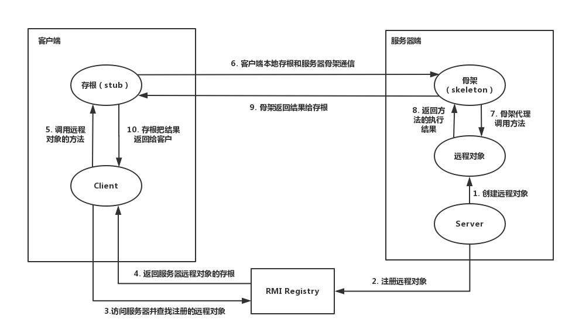
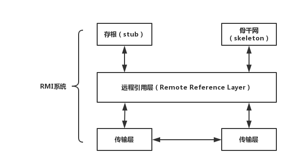

# JMI远程方法调用

## 定义

RMI：远程方法调用（Remote Method Invocation），它支持存储于不同地址空间的程序级对象之间彼此进行通信，实现远程对象之间的无缝远程调用

Java RMI：用于不同虚拟机之间的通信，这些虚拟机可以在不同的主机上、也可以在同一个主机上；一个虚拟机中的对象调用另一个虚拟机上的对象的方法，只不过是允许被远程调用的对象要通过一些标志加以标识

### 交互图



RMI由三个部分组成，第一个是rmiregistry（JDK提供的一个可以独立运行的程序），第二个是server端的程序，对外提供远程对象，第三个是client端的程序，调用远程对象的方法

首先，先启动rmiregistry服务，启动时可以指定**服务监听的端口**，也可以使用默认的端口（1099）

其次，server端在本地实例化一个提供服务的实现类，然后通过RMI提供的Name/Context/Registry等类的bind或rebind方法将刚才实例化好的实现类注册到rmiregistry并对外暴露一个名称

最后，client端通过本地的接口和一个已知的名称（即rmiregistry暴露出的名称）再使用RMI提供的Naming/Context/Registry等类的lookup方法从RMIService那里拿到实现类。虽然本地没有这个类的实现类，但所有的方法都在接口里，可以实现远程调用对象的方法了

存根和骨干网的具体通信过程



方法调用从客户端对象经存根stub、远程引用层Remote Reference Layer和传输层Transport Layer向下，传递给主机，然后再次经传输层，向上穿过远程调用层和骨干网Skleton，到达服务器对象

**存根**扮演着远程服务器对象的代理角色，使该对象可被服务器激活

**远程引用层**处理语义、管理单一或多重对象的通信，决定调用是应发往一个服务器还是多个

**传输层**管理实际的连接，并且追踪可以接受方法调用的远程对象

**骨干网**完成对服务器对象实际方法调用，并获取返回值

返回值向下经远程引用层、服务器端的传输层传递回客户端，再向上经传输层和远程调用层返回。最后，存根获得返回值

## JMI简单示例

### 1.定义一个远程接口

```java
package cn.zhanguozhi.rmiuse;

import java.rmi.Remote;
import java.rmi.RemoteException;

/**
 * 远程接口，必须实现java.rmi.Remote接口
 * 所有的参数和返回类型必须序列化（因为要网络传输）
 * 任意远程对象都可以实现此接口
 * 只有远程接口中的指定方法可以被调用
 */
public interface ReceiveMessageInterface extends Remote {

    // 所有方法必须抛出java.rmi.RemoteException
    void receiveRemoteMessage(String x) throws RemoteException;
}
```

### 2.远程接口实现类

```java
package cn.zhanguozhi.rmiuse;

import java.net.InetAddress;
import java.net.UnknownHostException;
import java.rmi.RemoteException;
import java.rmi.registry.LocateRegistry;
import java.rmi.registry.Registry;
import java.rmi.server.UnicastRemoteObject;

/**
 * 服务器端必须实现远程接口
 * 该类的实例变成远程对象可以使用两种方式
 *  1. 继承UnicastRemoteObject
 *  2.如果已经继承了其他类，可以在构造方法中调用UnicastRemoteObject的静态方法exportObject(Remote obj, int port)
 */
public class RMIServer extends UnicastRemoteObject implements ReceiveMessageInterface {

    int regPort;
    String thisAddress;
    Registry registry;

    public RMIServer() throws RemoteException {
        /*
        注册远程对象
        远程对象是远程服务创建的，无法确切的知道对象的名称
        但是将远程对象注册到rmi registry之后
        客户端就可以通过RMI Registry请求到该远程服务对象的stub
        利用stub就可以访问远程对象
         */
        try {
            thisAddress = (InetAddress.getLocalHost()).toString();
        } catch (UnknownHostException e) {
            throw new RemoteException("cannot get inet address");
        }
        // 注册表端口
        regPort = 3232;
        System.out.println("this address = " + thisAddress + ", port" + regPort);
        try {
            registry = LocateRegistry.createRegistry(regPort);
            /*
            下面这一行代码可以变成两行
            registry = LocateRegistry.getRegistry();
            registry.bind("rmiserver", this)
            */
            registry.rebind("rmiserver", this);
            System.out.println(this);
        } catch (RemoteException e) {
            throw e;
        }

        // 如果不像对象被继续调用，使用下面一行代码
        // UnicastRemoteObject.unexportObject(this, false);
    }

    @Override
    public void receiveRemoteMessage(String x) throws RemoteException {
        System.out.println(x);
    }
}
```

### 3.服务端

```java
package cn.zhanguozhi.rmiuse;

import java.rmi.RemoteException;

public class ServerProgram {

    public static void main(String[] args) {
        try {
            RMIServer rmi = new RMIServer();
        } catch (RemoteException e) {
            e.printStackTrace();
        }
    }
}
```

###  4.客户端

```java
package cn.zhanguozhi.rmiuse;

import java.rmi.AccessException;
import java.rmi.NotBoundException;
import java.rmi.RemoteException;
import java.rmi.registry.LocateRegistry;
import java.rmi.registry.Registry;

public class ClientProgram {

    public static void main(String[] args) {
        ReceiveMessageInterface rmiServer;
        Registry registry;
        String serverAddress = "127.0.0.1";
        String serverPort = "3232";
        String text = "Hello, server";
        System.out.println("sending " + text + " to " + serverAddress + ":" + serverPort);

        try {
            registry = LocateRegistry.getRegistry(serverAddress, Integer.parseInt(serverPort));
            // 从Registry中检索远程对象的存根/代理
            rmiServer = (ReceiveMessageInterface) registry.lookup("rmiserver");
            // 调用远程对象的方法
            boolean flag = rmiServer.receiveRemoteMessage(text);
            System.out.println(flag);
            System.out.println(rmiServer);
        } catch (AccessException e) {
            e.printStackTrace();
        } catch (RemoteException e) {
            e.printStackTrace();
        } catch (NotBoundException e) {
            e.printStackTrace();
        }
    }
}
```

总结：

所有远程对象remote object（需要继承UnicastRemoteObject）中需要给另一端使用的方法都是来自于一个继承java.rmi.Remote的接口，并且这些方法都需要抛出java.rmi.RemoteException（包括构造方法）

## RMI Calback

客户端的远程对象的方法传递给服务端，给服务端使用

RMI远程回调：

1. 定义继承Remote的接口ISomeCallback
2. 服务端RMI服务接口接受ISomeCallback作为参数 
3. 客户端实现SomeCallback extends UnicastRemoteObject implements ISomeCallback。
4. 客户端调用服务端RMI服务，SomeCallback callback作为参数。服务端收到后回调callback.onSomeThingHappened()

注意
1.回调不是用来传递一次性可以返回复杂结果，这样没效率
2.回调不是用来传递可以确定立即返回的结果，可以用来返回阶段性进度等
3.回调不要过多，而且不确定结束时间。要保证回调对象会被释放
4.如果RMI走的http，proxy之类的，可能会有问题
5.不要用回调替代消息