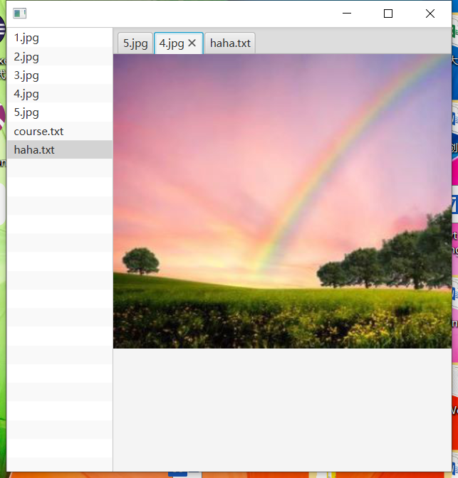

# JavaFX

## 开发环境

* 使用Eclipse进行开发
* 安装JavaFX插件
* JRE1.8及以上
* 字符集UTF-8

```java
从JDK11之后，将JavaFX从JDK中脱离了出去
如果使用JDK11及以上进行开发，可以使用maven项目添加javafx-controls、javafx-graphics、javafx-base、javafx-fxml依赖
并且对于idea和eclipse中自动生成的Main类，如果直接运行报错，可以使用一个App类，来启动Main
    
public class App {
    
    public static void Main(String[] args) {
        javafx.application.Application.launch(Main.class, args);
    }
}
```


## JavaFx入门

### 项目结构

* src/application：存放源代码和css样式
* JDK和JavaFx相关的Jar包
* build.fxbuild：用来做项目发布，可以选择版本（Windows/Linux）

### Main类的主要对象

Main是创建JavaFX项目自动生成的一个class，是程序的启动类

* Application：应用程序
* Stage：舞台（窗口）
* Scene：场景
* Node：节点

Stage -> Scene -> Pane(Node Tree)

## 基本控件

### 添加标签

javafx.scene.control.Label类

```java
// 在容器中添加一个标签，并居中显示
BorderPane root = new BorderPane();
Label label = new Label("你真的很不错");
root.setCenter(label);
```

BorderPane、Label  所有的容器/控件/形状都继承自Node

### 添加按钮

javafx.scene.control.Button类

```java
// 在容器中添加一个按钮，并居中显示
BorderPane root = new BorderPane();
Button btn = new Button("点我看你懂得");
root.setCenter(btn);
```

如果想要在点击按钮之后，触发事件，需要添加事件监听

事件的处理接口javafx.event.EventHandler

```java
public interface EventHandler<T extends Event> {
    /**
     * Invoked when a specific event of the type for which this handler is reigistered happens.
     * 
     */
    void handle(T event);
}
```

添加事件

```java
btn.setOnAction(new EventHandler<ActionEvent> {
    public void handle(ActionEvent e) {
        System.out.println("你好");
    }
})
```

注意：在JavaFX中，各种事件处理都是setOnXXX

### 添加复选框

CheckBox

如果要CheckBox响应事件

```java
CheckBox checkbox = new CheckBox();
checkbox.setSelected(item.isChecked());
checkbox.setText(item.getName());
checkbox.selectedProperty().addListener(new ChangeListener<Boolean>() {
    @Override
    public void changed(ObservableValue<? extends Boolean> observable, Boolean oldValue, Boolean newValue) {
        item.setChecked(newValue);
    }
});
```


### 显示图片

javafx.scene.image.Image：用于加载图片

javafx.scene.image.ImageView：用于显示图片

```java
// 加载图片
Image image = new Image(url);
ImageView imageView = new ImageView();
imageView.setImage(image);

root.setCenter(imageView);
```

url可以是网址，也可以是“file:"开头的本地路径，也可以是资源路径（classpath下的,在eclipse里面是src目录下）

获取图片的一些属性

```java
Image image = new Image(url);
// 获取宽度
double width = image.getWidth();
// 获取高度
double height = image.getHeight();
```

设置显示图片的属性

```
ImageView view = new ImageView();
view.setImage(image);
// 显示宽度400像素
view.setFitWidth(400);
// 显示高度400像素
view.setFitHeight(400);
```

### 语法分析

无论是容器还是控件，都是继承自Node

```
JavaFX里有几种Node
容器，如BorderPane，HBox
控件，如Button，Label
形状，如Circle， Rectangle（Text 也是形状）
图表，如PieChart，XYChart
其他，如Canvas， ImageView， MediaView， WebView
```


## 基本布局

### 边界布局BorderPane

上下左中右

```
// 添加控件到页面的上边
void setTop(Node value)

// 添加控件到页面的左边
void setLeft(Node value)

// 添加控件到页面的右边
void setRight(Node value)

// 添加控件到页面的中间
void setCenter(Node node)

// 添加控件到页面的下边
void setBottom(Node value)
```

### 水平布局HBox

HBox是一种水平布局的容器，可以容纳N个子节点

常用方法

```java
// 设置子控件的总体布局方式
// Pos是一个枚举类，可以设置上中下，左中右一个九个方位 加上baseline基线的左中右三个方位
void setAlignment(Pos value)

// 设置子控件对于自身的内边距，默认是0
// 这是父类Region定义的方法
void setPadding(Insets value)
    
// 获取当前Node的所有子节点
// 可以修改；但如果修改失败会撤销修改并抛出IllegalArgumentException；如果修改的线程不是JavaFX线程，会抛出IllegalStateException
// ？？感觉使用了观察者模式，修改之后对于所有使用当前Node列表的窗口都会显示更新（之后可以验证一下）
ObservableList<Node> getChildren();

// 对于ObservableList接口来说，可以添加Node来更新窗口
// 也可以使用继承自List接口的add方法添加
boolean addAll(E... elements)

// 对于HBox的子控件添加水平增长优先级，如果没有设置，默认不分配额外的空间
// Priority是一个枚举类，可以有三个值ALWAYS、NEVER、SOMETIMES
// ALWAYS是总是和其他拥有该优先级属性的控件分享多余的空间
// NEVER是不增加多余的空间，默认值是NEVER
// SOMETIMES是如果没有ALWAYS属性的控件，就和其他SOMETIMES属性的控件分享多余的空间
static void setHgrow(Node child, Priority value)
```

示例

```java
public class HBoxMain extends Application {

	@Override
	public void start(Stage primaryStage) throws Exception {
		try {
			HBox hBox = new HBox();
			hBox.setAlignment(Pos.CENTER);
			hBox.setPadding(new Insets(10));
			
            // 文本域
			TextField textField = new TextField();
			Button select = new Button();
			select.setText("选择文件");
			Button upload = new Button();
			upload.setText("点击上传");
			
			hBox.getChildren().addAll(textField, select, upload);
			HBox.setHgrow(textField, Priority.ALWAYS);
			
			Scene scene = new Scene(hBox,400,40);
            scene.getStylesheets().add(getClass()                                                                    .getResource("application.css").toExternalForm());
			primaryStage.setScene(scene);
			primaryStage.setTitle("HBox");
			primaryStage.show(); 
		} catch(Exception e) {
		e.printStackTrace();
		}
	}
}
```

### 垂直布局VBox

与HBox用法类似，具体查阅API

### 控件的尺寸

默认地，每个控件的尺寸不同，与文本长度有关

```
控件有三个属性
Min：最小属性
Max：最大属性
Pref：最佳属性

可以设置控件的Width（水平方向），Height（竖直方向），Size（宽度，高度）
比如设置size
setMinSize(double width, double height)
setPrefSize(double width, double height)
setMaxSize(double width, double height)
```

对于控件来说，修改尺寸可以更新窗口控件大小的是

	* 水平方向上setPrefWidth(double value)    最佳属性
	* 竖直方向上setMaxWidth(double value)    最大属性

结论：显示的尺寸最终由布局容器决定，min，pref，max只是参考值

#### 几个常量

* Control.USE_COMPUTED_SIZE  (-1.0)
* Control.USE_PREF_SIZE
* Double.MAX_VALUE

比如，USE_COMPUTED_SIZE控件能完全显示内容所需要的尺寸（即默认尺寸）

### 控件的布局

#### 填充、间距、对齐

* 填充Padding：子控件和当前控件的边距

  setPadding(new Insets(num))

  ```java
  HBox hBox = new HBox();
  hBox.setPadding(new Insets(10));
  hBox.setPadding(new Insets(10, 20, 30, 40));  // 上 右 下 左
  ```

  

* 间距Spacing：各个子控件之间的间距

  setSpacing(num)

  ```
  hBox.setSpacing(30);
  ```

  

* 对齐Alignment：靠左、靠右、居中

  setAlignment()

  ```java
  hBox.setAlignment(Pos.BOTTOM_LEFT);
  ```

#### 优先增长

HBox的setHgrow(Node, Priority)

VBox的setVgrow(Node, Priority)

#### 精确布局

***覆盖容器类的  layoutChildren()***

```java
public class HBoxMain extends Application {
	
	TextField textField = new TextField();
	Button select = new Button("选择文件");
	Button upload = new Button();
	
	@Override
	public void start(Stage primaryStage) throws Exception {
		try {
			HBox hBox = new HBox() {

                // 覆盖容器的layoutChildren实现精确布局
				@Override
				protected void layoutChildren() {
					// TODO Auto-generated method stub
					super.layoutChildren();
					double width = getWidth();
					double height = getHeight();
					
					// 第一个控件200像素，第二个控件是最佳属性，第三个控件是剩余空间
					double first = 200;
					double second = select.getWidth();
					double third = width - first - second;
					
                    // 调用resizeRelocate布局子控件
                    // 一般来说 这个方法只能允许父控件在layoutChildren中使用
                    // 参数  控件左上角的点的x/y坐标，宽度，高度
					textField.resizeRelocate(0, 0, first, height);
					select.resizeRelocate(first, 0, second, height);
					upload.resizeRelocate(first + second, 0, third, height);
				}
				
			};
            
            ...
        }
    }
```

#### 自定义容器

继承Pane类，并覆盖layoutChildren方法

容器的作用

* 包含多个子节点
* 负责多个子节点的布局

## 列表、树、表格、多项列表

### 列表控件ListView

#### 使用步骤

1. 定义数据项

   ```java
   private static class Student {
           public int id;
           public String name;
   
           public Student() {
           }
   
           public Student(int id, String name) {
               this.id = id;
               this.name = name;
           }
   
           public int getId() {
               return id;
           }
   
           public void setId(int id) {
               this.id = id;
           }
   
           public String getName() {
               return name;
           }
   
           public void setName(String name) {
               this.name = name;
           }
   
           @Override
           public String toString() {
               return "Student{" +
                       "id=" + id +
                       ", name='" + name + '\'' +
                       '}';
           }
       }
   ```

   

2. 创建一个数据源

   用一个ObservableList

   ```java
   ObservableList<Student> listData = FXCollections.observableArrayList();
   ```

3. 添加数据

   ```java
   Student stu1 = new Student(101, "张三");
   Student stu2 = new Student(102, "李四");
   Student stu3 = new Student(103, "王五");
   listData.add(stu1);
   listData.add(stu2);
   listData.add(stu3);
   ```

4. 创建ListView控件（需要添加泛型）

   ```java
   ListView<Student> listView = new ListView<Student>();
   ```

5. 设置数据源

   ```java
   listView.setItems(listData);
   ```

6. 设置单元格的显示

   * 添加一个ListCell类，重写updateItem(T item, boolean empty)

   ```java
   // 6.1负责单元格的显示
       private class MyListCell extends ListCell<Student> {
           @Override
           protected void updateItem(Student student, boolean b) {
               // FX框架必须要求先调用super.updateItem()
               super.updateItem(student, b);
   
               if (student != null) {
                   // 设置单元格显示的内容
                   this.setText(student.getId() + " : " + student.getName());
               }
           }
       }
   ```

   * 设置一个单元格生成器（工厂）

   ```java
   listView.setCellFactory(new Callback<ListView<Student>, ListCell<Student>>() {
               @Override
               public ListCell<Student> call(ListView<Student> param) {
                   return new MyListCell();
               }
           });
   ```

7. 添加到布局

   ```java
   BorderPane root = new BorderPane();
   root.setCenter(listView);
   ```

#### 列表项的操作

由于使用了观察者模式，ObservableList的修改会及时通知到所有使用它的控件，所以对于ObservableList的增加、删除、修改，就是对列表项的修改

获取当前选中的列表的行数

```java
int index = listView.getSelectionModel().getSelectionIndex();
```

如果index<0，即没有选中

修改操作

```java
btnUpdate.setOnAction(new EventHandler<ActionEvent>() {
            @Override
            public void handle(ActionEvent event) {
                int index = listView.getSelectionModel().getSelectedIndex();
                if (index < 0) {
                    return;
                }
                String idStr = tId.getText();
                String name = tName.getText();
                if ("".equals(idStr) || "".equals(name)) {
                    return;
                }
                int id = Integer.parseInt(idStr);
                Student temp = listData.get(index);
                temp.setId(id);
                temp.setName(name);
                listData.set(index, temp);
            }
        });
```

列表项如果是图形加文本

在设置单元格显示的那一步，可以使用setGraphic代替setText

### 树控件TreeView

1. TreeItem表示树上的一个节点
2. 一个TreeView必须有一个根节点
3. TreeItem可以添加TreeItem.setGraphic()

#### 使用步骤

1. 定义数据项

   ```java
   private static class ItemData {
           private String name;
           private boolean isDir;
   
           public ItemData(String name, boolean isDir) {
               this.name = name;
               this.isDir = isDir;
           }
   
           public String getName() {
               return name;
           }
   
           public void setName(String name) {
               this.name = name;
           }
   
           public boolean isDir() {
               return isDir;
           }
   
           public void setDir(boolean dir) {
               isDir = dir;
           }
       }
   ```

2. 单元格的显示

   1. 覆盖updateItem方法

   ```java
   private class MyTreeCell extends TreeCell<ItemData> {
           @Override
           protected void updateItem(ItemData item, boolean empty) {
               super.updateItem(item, empty);
               if (item != null) {
                   this.setText(item.getName());
               }
           }
       }
   ```

   	2. 设置单元格生成器

   ```java
    treeView.setCellFactory(new Callback<TreeView<ItemData>, TreeCell<ItemData>>() {
               @Override
               public TreeCell<ItemData> call(TreeView<ItemData> param) {
                   return new MyTreeCell();
               }
           });
   ```

   

3. 创建TreeView控件

   ```java
   TreeView<ItemData> treeView = new TreeView<>();
   ```

4. 添加节点

   1. 添加根节点

      ```java
      TreeItem<ItemData> item_root = new TreeItem<>(new ItemData("Java", true));
      treeView.setRoot(item_root);
      ```

   2. 添加子节点

      ```java
      TreeItem<ItemData> item_spring = new TreeItem<>(new ItemData("Spring", false));
      TreeItem<ItemData> item_Web = new TreeItem<>(new ItemData("阿贾克斯", false));
      item_root.getChildren().add(item_spring);
      item_root.getChildren().add(item_Web);
      ```

      

5. 

### 表格控件TableView

### 多列列表TreeTableView

* 特点
  * 整体是树形结构
  * 支持多列显示
  * 基于行进行操作，每行为一个TreeItem，每列显示一个字段

## 基本事件

### 鼠标事件

MouseEvent

```java
setOnMouseClicked(new EventHandler<MouseEvent>() {
    public void handle(MouseEvent event) {
        
    }
});
```

```java
// 获取鼠标单击的是左键、中键(滚轮)、右键
// MouseButton.PRIMARY(主键，通常是左键)
// MouseButton.MIDDLE(中键)
// MouseButton.SECONDARY(次键)
event.getButton();
// 移动(0)、单击(1)、双击(2)
event.getClickCount();
// 点击位置（窗口坐标）
event.getX();
// 点击位置（屏幕坐标）
event.getSceneX();
```

## 对话框

### 提示框Alert

```java
// 创建一个提示框
// AlertType有CONFIRMATION，ERROR，INFORMATION，NONE，WARNING
Alert warning = new Alert(AlertType.WARNINg);
// 设置提示框标题
warning.setHeaderText("出错");
// 设置提示框内容
warning.setContentText("用户名错误");
// 显示提示框
warning.showAndWait();
```

注意：showAndWait方法显示的提示框是模式的（modal），即需要完成当前提示框操作，程序才可以继续运行

如果想要非模式的对话框，可以调用show方法

对于提示框的结果，可以使用dialog.getResult().getButtonData()

## 图形

### 画布Canvas

```java
// 画布大小
final Canvas canvas = new Canvas(300,300);
GraphicsContext gc = canvas.getGraphicsContext2D();
// 设置填充颜色
gc.setFill(Color.BLUE);
// 设置填充颜色位置和大小
gc.fillRect(0,0,300, 300);
// 设置显示文本，距窗口左端100*100
gc.strokeText("Hello", 100, 100);
```

## 项目练习

### 阅读器



```java
package sample;

import javafx.application.Application;
import javafx.collections.FXCollections;
import javafx.collections.ObservableList;
import javafx.event.EventHandler;
import javafx.scene.Scene;
import javafx.scene.control.ListView;
import javafx.scene.control.Tab;
import javafx.scene.control.TabPane;
import javafx.scene.control.TextArea;
import javafx.scene.image.Image;
import javafx.scene.image.ImageView;
import javafx.scene.input.MouseButton;
import javafx.scene.input.MouseEvent;
import javafx.scene.layout.BorderPane;
import javafx.stage.Stage;

import java.io.*;

/**
 * 阅读器，可以阅读文件图片
 */
public class ReaderMain extends Application {

    private ListView<String> fileList = new ListView<>();
    private ObservableList<String> listData = FXCollections.observableArrayList();
    private TabPane tabPane = new TabPane();

    private String path = "C:\\Users\\zhanguozhi\\Pictures\\Saved Pictures";

    @Override
    public void start(Stage stage) throws Exception {
        BorderPane root = new BorderPane();
        addData(path);
        fileList.setItems(listData);
        fileList.setOnMouseClicked(new EventHandler<MouseEvent>() {
            @Override
            public void handle(MouseEvent event) {
                if (event.getButton() == MouseButton.PRIMARY && event.getClickCount() == 2) {
                    // 左键双击
                    String str = fileList.getSelectionModel().getSelectedItem();
                    System.out.println(str);
                    ObservableList<Tab> tabs = tabPane.getTabs();
                    for (Tab tab : tabs) {
                        if (tab.getText().equals(str)) {
                            int index = tabPane.getTabs().indexOf(tab);
                            tabPane.getSelectionModel().select(index);
                            return;
                        }
                    }
                    Tab tab = new Tab();
                    // 设置标题
                    tab.setText(str);
                    if (str.endsWith(".jpg")) {

                        // 图片
                        try {
                        // 设置内容
                            FileInputStream in = new FileInputStream(new File(path + "\\" + str));
                            Image image = new Image(in);
                            tab.setContent(new ImageView(image));
                        } catch (Exception e) {
                            e.printStackTrace();
                        }
                    } else if (str.endsWith(".txt")) {
                        // 文本
                        try {
                            BufferedReader br = new BufferedReader(new FileReader(new File(path + "\\" + str)));
                            TextArea tArea = new TextArea();
                            String data = null;
                            while ((data = br.readLine()) != null ) {
//                                tArea.appendText(new String(data.getBytes("GBK")) + System.getProperty("line.separator"));
                                tArea.appendText(data + System.getProperty("line.separator"));
                            }
                            tab.setContent(tArea);
                        } catch (Exception e) {
                            e.printStackTrace();
                        }
                    }
                    tabPane.getTabs().add(tab);
                    int index = tabPane.getTabs().indexOf(tab);
                    tabPane.getSelectionModel().select(index);
                }
            }
        });

        fileList.setPrefWidth(120);
        root.setLeft(fileList);
        root.setCenter(tabPane);
        Scene scene = new Scene(root,500,500);
//        scene.getStylesheets().add(getClass().getResource("application.css").toExternalForm());
        stage.setScene(scene);
        stage.show();
    }

    public void addData(String path) {
        File dir = new File(path);
        if (!dir.isDirectory()) {
            return;
        }
        String[] files = dir.list(new FilenameFilter() {
            @Override
            public boolean accept(File dir, String name) {
                if (name.endsWith(".jpg") || name.endsWith(".txt")) {
                    return true;
                }
                return false;
            }
        });
        listData.addAll(files);
    }
}
```

